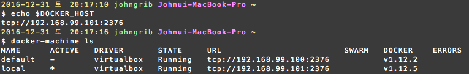
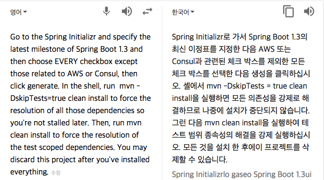

# Quest 00. Bootcamp 실습하고 스터디에 참여할 것

1단계 Bootcamp를 하기 위해서는 0단계 Setup을 먼저 해 주어야 한다.

## 0. Setup
Setup 단계를 하나하나 살펴보자.

### 0.1. 첫 번째로 설치하고 설정할 것들
> You will need JDK 8, Maven, an IDE and Docker in order to follow along. Specify important environment variables before opening any IDEs: JAVA_HOME, DOCKER_HOST.

- [x] JDK 8
- [x] Maven : `brew install maven` 해보니 already installed 라고 나온다.
- [x] IDE : IntelliJ IDEA를 사용하면 될 것 같다.
- [x] Docker
- [ ] JAVA_HOME
- [ ] DOCKER_HOST

음 두 개만 하면 다음으로 넘어갈 수 있겠군.

#### 0.1.1. JAVA_HOME
`JAVA_HOME`은 `echo $JAVA_HOME`으로 확인해 보니 설정된 값이 없길래 다음과 같이 `.bashrc`에 추가해주었다.
```shell
$ export JAVA_HOME=$(/usr/libexec/java_home)
```

- [x] JAVA_HOME

#### 0.1.2. DOCKER_HOST

Docker 머신을 하나 새로 생성해서 tcp 주소를 입력해주면 되는 건가?

**잘 모르겠다.** Docker에 대해 아는 것이 많지 않다. 구글링을 해봐도 워낙 아는 것이 없으니 명확하지 않다. 어쩌지.
일단 산책하러 나갔다가 동네 서점이 있길래 들어가 보았더니 [Docker 입문서 한 권](http://www.kyobobook.co.kr/product/detailViewKor.laf?ejkGb=KOR&mallGb=KOR&barcode=9791185890579&orderClick=LAG&Kc=)이 있길래 가볍게 훑어 보았다.

다행히도 지금 상황에 도움이 되는 조언이 있다. 집에 와서 실행해 보았다.
```shell
$ # docker machine을 생성한다.
$ docker-machine create --driver virtualbox local
    #...
    #boot2docker를 다운받아 설치하고, docker machine을 설치해 준다.
    #...
```

VirtualBox를 실행해 보니 `local`이라는 이름의 가상 머신이 추가되어 있다.

```shell
$ # docker client 에 전달할 환경 변수 몇 가지를 설정한다.
$ eval $(docker-machine env local)
```

위의 명령어로 설정한 환경 변수는 다음과 같이 확인할 수 있었다.

```shell
$ docker-machine env local
```

그랬더니 다음과 같이 출력되었다.

```
export DOCKER_TLS_VERIFY="1"
export DOCKER_HOST="tcp://192.168.99.101:2376"
export DOCKER_CERT_PATH="/Users/johngrib/.docker/machine/machines/local"
export DOCKER_MACHINE_NAME="local"
# Run this command to configure your shell:
# eval $(docker-machine env local)
```
DOCKER_HOST가 설정되었음을 확인할 수 있다.

좀 더 확실하게 보고 싶어서 `echo`와 `docker_machine ls`로 확인해 보았다.


- [x] DOCKER_HOST

### 0.2. 두 번째로 설치하고 설정할 것들
> Install [the Spring Boot CLI](http://docs.spring.io/autorepo/docs/spring-boot/current/reference/html/getting-started-installing-spring-boot.html#getting-started-installing-the-cli) and [the Spring Cloud CLI](https://github.com/spring-cloud/spring-cloud-cli).

#### 0.2.1. the Spring Boot CLI

[OSX Homebrew installation](http://docs.spring.io/autorepo/docs/spring-boot/current/reference/html/getting-started-installing-spring-boot.html#getting-started-homebrew-cli-installation)을 참고하여 다음과 같이 깔끔하게 설치하였다. 와우. 정말 쉽다.
```shell
$ brew tap pivotal/tap
$ brew install springboot
```

#### 0.2.2. the Spring Cloud CLI

[Installation](https://github.com/spring-cloud/spring-cloud-cli#installation)문서를 읽어보니
익숙한 brew가 아니라 [SDKMAN](http://sdkman.io/install.html)이라는 도구를 사용해 설치하는 예제가 나와 있다.

SDKMAN을 꼭 설치해서 써야 하나?

Spring Cloud CLI를 직접 빌드하는 것도 생각해 보았지만, 당장의 목표와 거리가 있으니 SDKMAN을 설치하였다.


```shell
$ curl -s "https://get.sdkman.io" | bash
$ source "$HOME/.sdkman/bin/sdkman-init.sh"
$ sdk version # 설치 완료 확인
```

이후로는 Installation문서에 나온대로 Spring Cloud CLI를 설치하였다.

```shell
$ sdk install springboot 1.4.1.RELEASE
$ sdk use springboot 1.4.1.RELEASE
$ mvn install
$ spring install org.springframework.cloud:spring-cloud-cli:1.2.3.BUILD-SNAPSHOT
```

### 0.3. 세 번째로 설치하고 설정할 것들
> [Install the Cloud Foundry CLI](https://docs.cloudfoundry.org/devguide/installcf/install-go-cli.html)

[Mac OS X Installation](https://docs.cloudfoundry.org/cf-cli/install-go-cli.html#mac)을 읽어보고 설치 시작.

```shell
$ brew tap cloudfoundry/tap
$ brew install cf-cli
$ cf # 설치 확인
```

### 0.4. 네 번째로 설치하고 설정할 것들
> Go to the [Spring Initializr](http://start.spring.io/) and specify the latest milestone of Spring Boot 1.3 and then choose EVERY checkbox except those related to AWS or Consul, then click generate. In the shell, run `mvn -DskipTests=true clean install` to force the resolution of all those dependencies so you're not stalled later. Then, run `mvn clean install` to force the resolution of the test scoped dependencies. You may discard this project after you've `install`ed everything.

의존성 문제 해결을 위해 몇 가지 명령어를 실행하라는 말 같은데 문장이 너무 길어서 내가 맞게 해석한 것인지 자신이 없다.

그래서 구글 번역을 돌려 보았더니 기대 이상으로 높은 품질의 번역 결과가 리턴되었다.



순서대로 따라해 보았다.

#### 0.4.1. [Spring Initializr](http://start.spring.io/)로 간다.
#### 0.4.2. Spring Boot 1.3의 최신 milestone을 확인한다.
* 들어가보니 최신 버전은 `2.0.0`. 시키는대로 `1.3.9(SNAPSHOT)`을 선택할 것인가?
* `git blame README.md | grep 'milestone of Spring Boot 1.3 and'`으로 확인해 보니 해당 부분은 2016-03-09에 작성된 것이다. 한편, [Spring Boot의 Releases](https://github.com/spring-projects/spring-boot/releases)를 확인해 보니 2016년 3월 6일에 `1.3.4`가 릴리즈 되었고, 10일에 `1.3.5`가 릴리즈 됐다. 따라서 해당 부분이 작성되었을 때와 정말 똑같은 환경을 꾸미려면 `1.3.4` 버전을 골라주면 될 것 같다.
* 마음은 `2.0.0`을 선택하고 싶지만, 지금은 스터디 환경을 마련하는 것이 중요하므로 `1.3.9` 선택.

#### 0.4.3. 모든 체크박스에 체크한다. 단, AWS나 Consul과 관련된 것은 체크하지 않는다.
* 가능한 한 많은 Depecdency를 골라두라는 것 같은데...
* 문제는 Spring Initializr에 체크박스가 없고 검색 입력란이 있다. 그동안 업데이트가 있었던 모양.
* 잘 모르겠으니 검색 칸의 placeholder에 나와 있는 Dependency를 모두 선택해 주었다.

**결과 : Web, Security, JPA, Actuator, DevTools를 선택하였다.**

#### 0.4.3. generate를 클릭한다.

* demo.zip 이라는 이름의 파일이 다운로드된다.
* 적당한 위치에 압축을 풀어 두었다.

#### 0.4.4. 터미널을 열고 `mvn -DskipTests=true clean install`을 입력한다.
* 위에서 압축을 해제한 위치로 이동하여 실행했다.
* Security 쪽에서 런타임 에러가 발생하여 명령어가 비정상 종료된다.
* 에러 메시지를 읽어보니 `Cannot locate policy or framework files!` 라는 문제인데, 해결이 쉽지 않다.
* 구글링을 해보니 Policy 문제라고 하며, Oracle에서 다운로드 받은 policy 파일을 JRE 경로에 복사해 넣어야 한다던가 OpenJDK를 설치해야 한다던가 하는 해결책들을 찾아볼 수 있었다.
* 그러나 모두 실패.
* 혹시 버전 문제인가 싶어 다음과 같이 하였더니 문제 없이 진행되었다.

```shell
brew update
brew cask install java
mvn -DskipTests=true clean install
```

* 시계를 보니 17시 26분. 일요일을 다 날린 것 같았지만, 그래도 2시간 반 만에 해결한 셈. 더 오래 걸리지 않아 다행이다.

#### 0.4.5. `mvn clean install`을 입력한다.

* 실행해 보니 또 에러가 발생한다.
* 또 에러야?! 하면서 터미널을 스크롤 해보니 `Cannot determine embedded database driver class for database type NONE` 라고 한다. database driver class 라면 아직 DB 관련 설정을 하나도 하지 않았으니 당장은 무시해도 괜찮을 것 같다. 넘어가고 나중에 생각하자.

### 0.5. 다섯 번째로 설치하고 설정할 것들
> For multi-day workshops only: Run each of the `.sh` scripts in the `./bin` directory; run `psql.sh` after you've run `postgresh.sh` and confirm that they all complete and emit no obvious errors

* multi-day workshops라면 `./bin`의 모든 `.sh`스크립트를 실행하고, 실행 중 에러가 발생하지 않는지 확인하라고 한다.
* 내가 현재 진행하고 있는 과정이 multi-day workshops인지는 잘 모르겠지만 일단 따라해 보자.
* 작업 중인 경로의 `/bin`에 sh 파일이 없는 것은 확인했다. 어디에 있을까? 잘 모르겠어서 일단 산책을 나갔다.
* 생각해보니 뻔했다. [여기](https://github.com/joshlong/cloud-native-workshop/tree/master/bin)에 있다.

목록은 다음과 같다. 내가 실행한 순서대로 나열하였다.

* `consul.sh`
* `postgresql.sh`
* `psql.sh` : `postgresql.sh`를 실행한 후에 실행하라고 설명에도 나와 있다.
* `redis.sh`
* `redis-cli.sh` : `redis.sh`를 먼저 실행하지 않으면 에러가 발생한다.
* `graphite.sh`
* `rabbitmq.sh`
* `zipkin.sh`

각각의 sh script를 실행할 때마다 해당 도구를 다운로드 받아 설치하게 된다.
만약 각각의 sh script를 다른 터미널에서 실행한다면, 실행 전에 `eval $(docker-machine env local)`를 먼저 실행해 주어야 `DOCKER_HOST`가 설정되어 에러가 발생하지 않는다.

## 1. "Bootcamp"

Bootcamp의 주요 목표는 기본적인 Spring Boot 애플리케이션을 빌드하는 방법을 배우는 것이다.

단계를 하나하나 살펴보자.

### 1.1. 첫 번째로 할 일

> Go to the [Spring Initializr](http://start.spring.io/) and select H2, REST Repositories, JPA, Web. Select the latest Spring Boot 1.3.x version. give it an `artifactId` of `reservation-service`.

* H2, REST Repositores, JPA, Web을 선택.
* Spring Boot는 `1.3.9` 버전을 선택.
* `actifactId`는 아무렇게나 지정해도 되는 걸까? 일단 기본값인 `demo`를 그대로 두고 `generate` 버튼을 클릭하였다.

### 1.2. 두 번째로 할 일

> Run `mvn clean install` and import it into your favorite IDE using Maven import.

* `mvn clean install`. 별다른 문제 없이 성공하였다.
* IDE는 IntelliJ IDEA를 선택.
    * IntelliJ IDEA에서 `File > New > Project from Existing Sources...` 선택.
    * Spring Initializr에서 다운로드 받아 압축을 해제한 경로 선택.
    * `Import Projct`에서 `Import Project from external model`의 `maven`선택.
    * 이후로는 계속 `Next` 만 입력하였다.

### 1.3. 세 번째로 할 일

> Add a simple entity (`Reservation`) and a repository (`ReservationRepository`)

* 이건 JPA 이야기 같다. JPA는 다뤄본 적이 없기 때문에 [Accessing Data with JPA](https://spring.io/guides/gs/accessing-data-jpa/)라는 문서를 참고했다.

* 일단 간단한 Entity를 하나 만들어 보았다.

```java
package entity;

import javax.persistence.Entity;

@Entity
public class Reservation {

    private Long id;
    private String name;

    public Reservation(Long id, String name) {
        this.id = id;
        this.name = name;
    }
}
```

* 간단한 Repository도 만들어 보았다.

```java
package repository;

import entity.Reservation;
import org.springframework.data.repository.CrudRepository;

import java.util.List;

public interface ReservationRepository extends CrudRepository<Reservation, Long> {

    List<Reservation> findByName(final String Name);
}
```

### 1.4. 네 번째로 할 일

> Map the repository to the web by adding `org.springframework.boot:spring-boot-starter-data-rest` and then annotating the repository with `@RepositoryRestResource`

* 난관 봉착. 시키는 대로 하고는 있는데 `org.springframework.boot:spring-boot-starter-data-rest`가 뭔지 모르겠다.
* `pom.xml`을 열어보니 다음 부분이 눈에 들어온다.

```xml
<dependency>
    <groupId>org.springframework.boot</groupId>
    <artifactId>spring-boot-starter-data-rest</artifactId>
</dependency>
```

* `pom.xml`에 `spring-boot-starter-data-rest`가 있으니 된 건가? 잘 모르겠다.
* Repository에는 `@RepositoryRestResource` 어노테이션을 붙여 주었다.

```java
package repository;

import entity.Reservation;
import org.springframework.data.repository.CrudRepository;
import org.springframework.data.rest.core.annotation.RepositoryRestResource;

import java.util.List;

@RepositoryRestResource
public interface ReservationRepository extends CrudRepository<Reservation, Long> {

    List<Reservation> findByName(final String Name);
}

```

### 1.5. 다섯 번째로 할 일

> Add custom Hypermedia links

* Hypermedia라는 단어가 익숙하지 않아 사전을 찾아봐야 했다.
찾아보니 학술적인 정의 외에 특별한 설명이 없어 좀 당황하긴 했는데, 침착하게 생각해보니 클릭했을 때 JSON 형식의 데이터를 돌려주는 링크를 만들어 붙이라는 말로 이해해도 될 것 같다.
* 그러기 위해 간단한 Controller를 작성하였다.

```java
package controller;

import entity.Reservation;
import org.springframework.http.ResponseEntity;
import org.springframework.web.bind.annotation.RequestMapping;
import org.springframework.web.bind.annotation.RestController;

@RestController
public class ReservationController {

    @RequestMapping("/reservation")
    public ResponseEntity<Object> reservation() {
        final Reservation res = new Reservation(1l, "test");
        return ResponseEntity.ok(res);
    }
}
```

### 1.6. 여섯 번째로 할 일

> Write a simple unit test

* 테스트는 다음과 같이 추가해 주었다. 돌려보니 pass가 나온다.

```java
package com.example;

import controller.ReservationController;
import entity.Reservation;
import org.junit.Test;
import org.springframework.http.HttpStatus;
import org.springframework.http.ResponseEntity;
import static org.junit.Assert.assertEquals;

public class ReservationTests {

    @Test
    public void contextLoads() {
        ReservationController cont = new ReservationController();
        ResponseEntity<Object> res = cont.reservation();

        HttpStatus stat = res.getStatusCode();

        assertEquals("stat code가 200이어야 한다.", 200, stat.value());

        Reservation r = (Reservation) res.getBody();
        assertEquals("name이 test여야 한다.", "test", r.getName());
    }
}
```

* 여기까지의 작업은 모두 [github](https://github.com/johngrib/cloudnative_study/commit/49e14dae49e343ac2b23aca22c22e228e160ae31)에 올려두었다.

### 1.7. 일곱 번째로 할 일

> Observe that we have a Maven wrapper in the build to support reproducible builds

이건 무슨 말인지 잘 모르겠다. 빌드 과정을 지켜보라는 건가?

