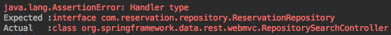
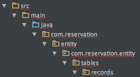
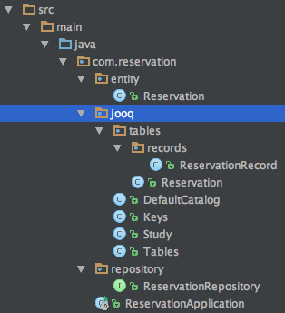
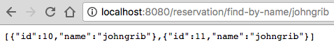

# Quest 01. Bootcamp 복습 외

이번 퀘스트는 크게 세 가지로 구성되어 있다.

1. Bootcamp를 복습할 것
1. 단위 테스트를 작성할 것
1. JPA 기반의 코드를 JOOQ 기반으로 변경해 볼 것

하나씩 수행해 보자.

## 1. Bootcamp를 복습할 것

### 1.1. [Quest 00](./quest00.md)에서 내가 작성했던 코드를 수정해보자

#### 1.1.1. 참고 자료

* 스터디장님이 정리한 [지난 스터디 요약](http://wiki.woowa.in/pages/viewpage.action?spaceKey=BMFRESH&title=1.+Bootcamp).
* [_**자바 챔피언 Josh Long**_ 아저씨의 라이브 코딩 동영상](https://www.youtube.com/watch?v=fxB0tVnAi0I)

#### 1.1.2. 수정한 내용
* Entity 객체 수정
    * `id` 필드에 `@Id`와 `@GeneratedValue` 어노테이션을 달아 주었다.
    * `id` 필드가 `primary key`역할을 하고 있으며, 값이 자동으로 생성된다는 사실을 표현할 수 있다.

```java
@Id
@GeneratedValue
private Long id;
```

* Repository 수정
    * `CrudRepository`상속에서 `JpaRepository`상속으로 변경.
        * 어차피 `JOOQ`로 바꿀 것이긴 하지만 복습이니까 괜찮아. `JPA`로 씩씩하게 변경.
    * `@RestResource`와 `@Param` 어노테이션을 추가해 Rest API답게 작동할 수 있도록 수정해 주었다.

```java
@RepositoryRestResource
public interface ReservationRepository extends JpaRepository<Reservation, Long> {
    @RestResource(path = "by-name")
    List<Reservation> findByName(@Param("rn") final String Name);
}
```

#### 1.1.3. 실행

그런데 작업을 마치고 Run 해보니 실행이 되지 않는다. class path 문제.
* Josh Long 아저씨가 동영상에서 한 것처럼 모든 코드를 하나의 Java 파일로 옮긴 다음, Run 해보니 실행된다.
* 시험삼아 클래스 단위로 하나씩 옮겨 보았는데 하나라도 옮기면 실행되지 않는다.

고생 끝에 조건희 선임님의 조언을 받아 해결할 수 있었다.
> 😃 : 다른 클래스 파일들이 `@SpringBootApplication` 어노테이션이 있는 클래스 파일의 패키지 이하에 있어야 합니다~

* 원인은 바로 main 메소드를 정의한 `ReservationController` class에 붙인 `@SpringBootApplication` 어노테이션.
* 건희님 조언대로 패키지 구성을 변경하였다.
* 어노테이션의 의미에 맞추어 클래스 이름도 `ReservationController`에서 `ReservationApplication`으로 변경해 주었다.

구동해 보니
* `http://localhost:8080/reservations`로 접속해 보면 결과가 잘 출력된다. (건희님 감사합니다.)
* `http://localhost:8080/reservations/search/by-name?rn=A`도 잘 나온다.

```json
/* http://localhost:8080/reservations/search/by-name?rn=A 호출 결과 */
{
  "_embedded" : {
    "reservations" : [ {
      "name" : "A",
      "_links" : {
        "self" : { "href" : "http://localhost:8080/reservations/1" },
        "reservation" : { "href" : "http://localhost:8080/reservations/1" }
      }
    } ]
  },
  "_links" : {
    "self" : { "href" : "http://localhost:8080/reservations/search/by-name?rn=A" }
  }
}
```

이전의 패키지 구성은 다음과 같았다.
```
# 작동하지 않는 패키지 구성
src
  └ main
      └ java
          ├ controller
          │   └ [class] ReservationController (@SpringBootApplication)
          │
          ├ entity
          │   └ [class] Reservation (@Entity)
          │
          └ repository
              └ [interface] ReservationRepository (@RepositoryRestResource)
```

새로 구성한 패키지 구성은 다음과 같다.
```
# 작동하는 패키지 구성
src
  └ main
      └ java
          └ com.reservation
              ├ entity
              │   └ [class] Reservation (@Entity)
              │
              ├ repository
              │   └ [interface] ReservationRepository (@RepositoryRestResource)
              │
              └ [class] ReservationApplication (@SpringBootApplication)
```

다음은 IntelliJ IDEA의 Decompiler로 확인한 `@SpringBootApplication` 코드이다.

```java
package org.springframework.boot.autoconfigure;

@java.lang.annotation.Target({java.lang.annotation.ElementType.TYPE})
@java.lang.annotation.Retention(java.lang.annotation.RetentionPolicy.RUNTIME)
@java.lang.annotation.Documented
@java.lang.annotation.Inherited
@org.springframework.context.annotation.Configuration
@org.springframework.boot.autoconfigure.EnableAutoConfiguration
@org.springframework.context.annotation.ComponentScan
public @interface SpringBootApplication {
    java.lang.Class<?>[] exclude() default {};

    java.lang.String[] excludeName() default {};

    @org.springframework.core.annotation.AliasFor(annotation = org.springframework.context.annotation.ComponentScan.class, attribute = "basePackages")
    java.lang.String[] scanBasePackages() default {};

    @org.springframework.core.annotation.AliasFor(annotation = org.springframework.context.annotation.ComponentScan.class, attribute = "basePackageClasses")
    java.lang.Class<?>[] scanBasePackageClasses() default {};
}
```

코드를 읽어보면 `scanBasePackages()`와 `scanBasePackageClasses()`를 통해 이 어노테이션이 작동과정에서 패키지 구조를 검색한다는 사실을 미루어 추측할 수 있다. 정확한 작동 구조는 파악할 수 없더라도, 처음 보는 애노테이션을 마주했을 때 곧바로 Decompiler로 확인했다면 조금 더 빨리 문제를 해결할 수 있었을 것 같다는 생각이 든다.

그래도 만족하기엔 좀 곤란해서 `@SpringBootApplication` 어노테이션에 대한 [Spring Boot docs](http://docs.spring.io/spring-boot/docs/2.0.0.BUILD-SNAPSHOT/reference/htmlsingle/#using-boot-using-springbootapplication-annotation)를 찾아보았다.

> The @SpringBootApplication annotation is equivalent to using @Configuration, @EnableAutoConfiguration and @ComponentScan with their default attributes:

* 패키지 구조에 대한 설명은 없고 다음 어노테이션들을 기본값으로 설정한 것과 같다는 설명만 나와 있다.
    * `@Configuration`
    * `@EnableAutoConfiguration`
    * `@ComponentScan`
* `@SpringBootApplication`을 이해하기 위해서는 저 세 어노테이션을 학습하면 된다는 뜻으로 이해해 두었다.

그리고 [Spring Boot docs](http://docs.spring.io/spring-boot/docs/2.0.0.BUILD-SNAPSHOT/reference/htmlsingle/#using-boot-locating-the-main-class)에서 다음과 같은 설명을 찾아낼 수 있었다.

> Using a root package also allows the `@ComponentScan` annotation to be used without needing to specify a `basePackage` attribute. You can also use the `@SpringBootApplication` annotation if your main class is in the root package.

위의 글을 요약하자면 다음과 같다.
* root package를 사용하면`@ComponentScan` 어노테이션을`basePackage` 속성을 지정할 필요없이 사용할 수 있다.
* main class가 root package에 있다면`@SpringBootApplication`어노테이션을 사용할 수 있다.

다음으로 넘어가자.


## 2. 단위 테스트를 작성할 것

### 2.1. MockMvc를 사용한 테스트 코드 작성

[Quest 00](./quest00.md)에서는 jUnit을 사용하여 기본적인 형태의 클래스 테스트 코드를 작성하였다.  
그러나 일단 퀘스트 조건을 만족시키기 위해 작성한 클래스 생성 테스트 코드였을 뿐, 적절한 테스트 코드라 보기는 어렵다고 생각한다.  
지난번 스터디 막바지에 박용권 책임님이 스프링에 걸맞는 테스트 코드 이야기를 언급하셨던 것이 기억났다.
* 스프링과 잘 어울리는 테스트 코드란 무엇일까? **모르겠다.**
* 산책 나간 김에 동네 서점에 갔더니 [스프링과 관련된 책이 딱 한 권](http://www.kyobobook.co.kr/product/detailViewKor.laf?ejkGb=KOR&mallGb=KOR&barcode=9791187345534&orderClick=LEA&Kc=) 있었다.
* 목차를 읽어보니 `4장 스프링 부트 테스트하기`라는 챕터 제목이 보인다. 훑어보니 쓸만해 보이는 예제도 있다. 오케이.

집에 돌아와서는 책을 참고하여 다음과 같은 테스트 코드를 작성하였다.

```java
@RunWith(SpringJUnit4ClassRunner.class)
@SpringApplicationConfiguration(classes = ReservationApplication.class)
@WebAppConfiguration
public class ReservationTests {

    @Autowired
    private WebApplicationContext webContext;    // WebApplicationContext 주입
    private MockMvc mockMvc;

    @Before
    public void setupMockMvc() {
        mockMvc = MockMvcBuilders.webAppContextSetup(webContext).build();
    }

    @Test
    public void reservationTest() throws Exception {

        mockMvc.perform(
            MockMvcRequestBuilders
                .get("/reservations/search/by-name")    // 이렇게 하면 지정한 주소로 request를 보낼 수 있다
                .param("rn", "A")                       // parameter로 rn=A 를 설정한다
                .contentType(MediaType.APPLICATION_JSON)
        )
        .andExpect(MockMvcResultMatchers.status().isOk())   // 응답 확인
        ;
    }
}
```

테스트를 돌려보니 녹색 선이 표시된다.
* 단순하게 `new 뫄뫄()`해서 테스트하는 것보다 훨씬 웹 애플리케이션을 테스트하는 코드다워졌다.
* 그런데 json 값의 특정 key를 따로 조사해서 내가 기대하는 value가 존재하는지를 확인할 수 있으면 좋겠다.
* 그런 게 없을리 가 없으니 일단 구글링하였다.
    * 찾아보니 `jsonPath`라는 것을 통해 response로 받은 json 객체를 조사할 수 있는 모양이다.

### 2.2. jsonPath를 사용하여 json 값 테스트 코드 작성

구글 신의 도움을 받아 jsonPath 사용법을 조사하고, 약간의 시행착오를 거친 후 다음과 같은 코드를 작성하였다.

```java
/* http://localhost:8080/reservations/search/by-name?rn=A 호출 결과의 name값이 A인지를 테스트하는 코드이다. */
@Test
public void reservationTest() throws Exception {

    mockMvc.perform(
        MockMvcRequestBuilders
            .get("/reservations/search/by-name")
            .param("rn", "A")
            .contentType(MediaType.APPLICATION_JSON)
    )
    .andExpect(MockMvcResultMatchers.status().isOk())
    .andDo(MockMvcResultHandlers.print())
    .andExpect(MockMvcResultMatchers.jsonPath("$._embedded.reservations[0].name").value("A"))
    ;
}
```

돌려보니 `/jsonpath/InvalidPathException`라는 에러가 발생하며 돌아가지 않는다. 원인이 무엇일까?
* 처음에는 jsonPath 문자열을 잘못 입력해서 그런 줄 알고 여러 가지 시도를 했다.
    * [여기](https://jsonpath.herokuapp.com/)에서 jsonPath 문자열을 테스트해보며 작성하였다.
* 지쳐 쓰러질 무렵 `pom.xml`에 `jsonPath`를 추가해주지 않았기 때문에 발생한 문제가 아닐까 하는 의심을 하게 되었다.
* 자동완성 되길래 `MockMvc`에 포함되어 있는 라이브러리로 생각했었는데 아닌 모양이다.
* 따라서 아래와 같이 jsonPath를 추가해 주었다. 이제 잘 되겠지.

```xml
<dependency>
    <groupId>com.jayway.jsonpath</groupId>
    <artifactId>json-path</artifactId>
    <scope>test</scope>
</dependency>
```

잘 될 줄 알았는데 그래도 에러가 발생한다!

* 알고보니 오타가 있었다. `embedded`를 `embeded`라고 썼다. 이걸 찾는데 40분이나 걸렸다!
* 오타를 고치니 잘 돌아갔다.

### 2.3. 실험: `@RepositoryRestResource`어노테이션은 컨트롤러를 만들어 주는 걸까?
MockMvc의 기능 중, 어느 컨트롤러가 요청을 받아 처리하는지 검사하는 것도 있길래 한 가지 실험을 해봐야겠다는 생각이 들었다.

* `ReservationRepository`는 `@RepositoryRestResource` 애노테이션을 통해 컨트롤러가 없어도 요청을 직접 받아 처리하게 되는 것 같았는데, 그걸 확인해보기 위해 아래와 같은 코드를 작성하였다.
* `ReservationRepository`는 컨트롤러인가? 컨트롤러라면 테스트 결과는 `success`, 아니라면 `fail`일 것이다.
```java
@Test
public void reservationTest() throws Exception {

    mockMvc.perform(
        MockMvcRequestBuilders
            .get("/reservations/search/by-name")
            .param("rn", "A")
            .contentType(MediaType.APPLICATION_JSON)
    )
    .andExpect(MockMvcResultMatchers.status().isOk())
    // 컨트롤러를 확인한다.
    .andExpect(MockMvcResultMatchers.handler().handlerType(ReservationRepository.class))
    ;
}
```

* 테스트를 돌려보니 `fail`이 떨어진다.
* `ReservationRepository`가 컨트롤러가 아니라는 뜻.
* 그럼 어디선가 컨트롤러의 역할을 해 주는 녀석이 있다는 것인데 그게 누군지는 모르겠다.

라고 생각하고 있었는데 문득 콘솔을 살펴보니 답이 있었다.


`@RepositoryRestResource`애노테이션을 사용하면 `RepositorySearchController`가 컨트롤러로 활약하게 되는 모양이다.

밤 11시가 되었다. 이제 불 끄고 잘 시간이다.

## 3. JPA 기반의 코드를 JOOQ 기반으로 변경해 볼 것

기분 좋은 일요일 아침이다. 찾아보니 [jooq-in-7-steps](https://www.jooq.org/doc/3.9/manual/getting-started/tutorials/jooq-in-7-steps/)라는 문서가 있다. 다행이다. (일곱 번 만에 되면 좋겠다.)  
일곱 단계를 하나씩 따라해 보았다.

### 3.1. [Step 1: Preparation](https://www.jooq.org/doc/3.9/manual/getting-started/tutorials/jooq-in-7-steps/jooq-in-7-steps-step1/)

`pom.xml`에 다음을 추가해 준다.
```xml
<dependency>
    <groupId>org.jooq</groupId>
    <artifactId>jooq</artifactId>
    <version>3.9.0</version>
</dependency>
<dependency>
    <groupId>org.jooq</groupId>
    <artifactId>jooq-meta</artifactId>
    <version>3.9.0</version>
</dependency>
<dependency>
    <groupId>org.jooq</groupId>
    <artifactId>jooq-codegen</artifactId>
    <version>3.9.0</version>
</dependency>
```

`pom.xml`에 위의 항목을 추가했더니 IntelliJ IDEA가 빨간 폰트로 이런 애들 모르겠다고 해서 살짝 겁먹었는데, 화장실에 다녀오니 경고 문구가 사라져 있었다. 그동안 다운로드를 받은 모양.

### 3.2. [Step 2: Your database](https://www.jooq.org/doc/3.9/manual/getting-started/tutorials/jooq-in-7-steps/jooq-in-7-steps-step2/)

* docker mysql에 `study` database를 만들고 `reservation` 테이블을 만들어 주었다.
* `reservation`테이블의 필드 각각은 `Reservation` ENTITY에서 정의한 그대로 사용하였다.

```sql
CREATE DATABASE `study` charset utf8;

USE `study`

CREATE TABLE `reservation` (
  `id` int NOT NULL AUTO_INCREMENT,
  `name` varchar(255) DEFAULT NULL,
  PRIMARY KEY (`id`)
);
```

### 3.3. [Step 3: Code generation](https://www.jooq.org/doc/3.9/manual/getting-started/tutorials/jooq-in-7-steps/jooq-in-7-steps-step3/)

> In this step, we're going to use jOOQ's command line tools to generate classes that map to the Author table we just created. More detailed information about how to set up the jOOQ code generator can be found here:  
[jOOQ manual pages about setting up the code generator](https://www.jooq.org/doc/3.9/manual/code-generation/)  
The easiest way to generate a schema is to copy the jOOQ jar files (there should be 3) and the MySQL Connector jar file to a temporary directory. Then, create a library.xml that looks like this:

요약해 보면 다음과 같다.

* 이 단계에서는 jooq의 커맨드 라인 도구를 사용해서 앞에서 만든 테이블과 매핑되는 클래스를 생성할 것이다.
* 자세한 내용은 [매뉴얼](https://www.jooq.org/doc/3.9/manual/code-generation/)을 참조할 것.
* 제일 쉬운 방법은 `jooq` jar 파일과 `mysql connector` jar 파일을 임시 디렉토리에 복사하고 접속 정보가 담긴 `library.xml`을 만드는 것이다.

난 제일 쉬운 방법을 선택하는 걸 좋아한다.

#### 3.3.1. `jooq` jar 파일을 임시 디렉토리에 복사

* `~/jooqtemp` 라는 디렉토리를 만들었다.
* [jooq download](https://www.jooq.org/download/)에서 `Open Source: jOOQ 3.9.0`를 선택하여 다운로드 받았다.
* 압축을 풀고 모든 jar 파일을 `~/jooqtemp` 디렉토리로 복사하였다.

* 눈치 좋게 다음 코드를 `pom.xml`파일에 미리 추가해 주었다.
```xml
    <dependency>
        <groupId>org.jooq</groupId>
        <artifactId>jooq</artifactId>
        <version>3.9.0</version>
    </dependency>
```

* 다운로드 할 것 없이 maven 저장소의 jar 파일을 사용해 한 번에 끝내는 방법도 있겠지만 생각하기 귀찮다. 패스.

#### 3.3.2. `mysql connector` jar 파일을 임시 디렉토리에 복사

* [mysql downloads](https://dev.mysql.com/downloads/file/?id=13520)에서 `mysql-connector-java-3.1.14.zip`을 다운로드하였다.
* 압축을 풀어보니 `mysql-connector-java-3.1.14-bin.jar`가 있길래 `~/jooqtemp` 디렉토리로 복사해 주었다.

* `pom.xml`에도 다음과 같이 추가해 주었다.
```xml
    <dependency>
        <groupId>mysql</groupId>
        <artifactId>mysql-connector-java</artifactId>
        <version>6.0.5</version>
    </dependency>
```

#### 3.3.3. `library.xml` 설정 파일 작성

다음은 내가 작성한 `library.xml` 이다. (xml 파일 이름은 아무렇게나 지어도 상관없다)
```xml
<?xml version="1.0" encoding="UTF-8" standalone="yes"?>
<configuration xmlns="http://www.jooq.org/xsd/jooq-codegen-3.9.0.xsd">
    <jdbc>
        <!-- 접속정보 -->
        <driver>com.mysql.jdbc.Driver</driver>
        <url>jdbc:mysql://docker_mysql_주소:3306/study</url>
        <user>사용자</user>
        <password>패스워드</password>
    </jdbc>
    <generator>
        <name>org.jooq.util.JavaGenerator</name>
        <database>
            <name>org.jooq.util.mysql.MySQLDatabase</name>
            <inputSchema>study</inputSchema>    <!-- database -->
            <includes>.*</includes>             <!-- 코드를 생성할 테이블 이름 패턴 -->
            <excludes></excludes>               <!-- 제외할 테이블 이름 패턴 -->
        </database>
    <target>
        <!-- 생성된 테이블 코드들의 상위 패키지명과 파일을 복사할 디스크 경로명 -->
        <packageName>com.reservation.jooq</packageName>
        <directory>/Users/johngrib/git/cloudnative_study/src/main/java/</directory>
        <!--
            잘못 작성한 예1 : 처음에 이렇게 했다가 패키지 경로 대참사가 벌어졌다.
        <packageName>com.reservation.entity</packageName>
        <directory>/Users/johngrib/git/cloudnative_study/src/main/java/com/reservation/entity</directory>

            잘못 작성한 예2 : 이렇게 했다가 그동안 작성한 거의 모든 class가 날아갔다. 다행히 git으로 복구했다.
        <packageName>jooq</packageName>
        <directory>/Users/johngrib/git/cloudnative_study/src/main/java</directory>

            잘못 작성한 예3 : 생성된 모든 java 파일의 패키지 경로가 꼬여 있다.
        <packageName>jooq</packageName>
        <directory>/Users/johngrib/git/cloudnative_study/src/main/java/com/reservation/entity</directory>
        -->
    </target>
  </generator>
</configuration>
```

#### 3.3.4. 생성 명령어 실행

* [jooq 매뉴얼](https://www.jooq.org/doc/3.9/manual/getting-started/tutorials/jooq-in-7-steps/jooq-in-7-steps-step3/)에서 제공하고 있는 명령어를 그대로 복사해서 입력하면 줄바꿈 때문에 에러가 떨어진다.
* 줄바꿈을 스페이스로 바꾼 다음, 터미널에 입력해야 한다.
* jar 파일들의 버전 넘버를 잘 확인하고 명령어를 수정해 주어야 돌아간다.

2회 실패하고 다음의 돌아가는 명령어를 얻어낼 수 있었다.
```shell
java -classpath jooq-3.9.0.jar:jooq-meta-3.9.0.jar:jooq-codegen-3.9.0.jar:mysql-connector-java-3.1.14-bin.jar:. org.jooq.util.GenerationTool library.xml
```

참고로 `library.xml`파일의 `target.directory`를 잘못 설정하면 다음과 같이 엉뚱한 곳에 잔뜩 생성되는 문제가 발생할 수 있다.


와장창

다음은 만족스럽게 jooq 코드가 생성된 경우이다.




### 3.4. [Step 4: Connect to your database](https://www.jooq.org/doc/3.9/manual/getting-started/tutorials/jooq-in-7-steps/jooq-in-7-steps-step4/)

일단 jooq에서 소개하는 방식으로 다음과 같은 코드를 main 메소드에 추가해 주었다.
```java
try (Connection conn = DriverManager.getConnection(url, userName, password)) {
    System.out.println("connected!");
} catch (Exception e) {
    e.printStackTrace();
}
```

* 구동해 보니 잘 된다.
* 튜토리얼이라 그런 거겠지만 `url`, `userName`, `password`를 raw string으로 메인 메소드에 때려박았다. 어휴 곰팡이 냄새.

접속 정보 분리는 다음 할 일로 남겨두고, 일단은 7단계를 마무리하도록 하자.

### 3.5. [Step 5: Querying](https://www.jooq.org/doc/3.9/manual/getting-started/tutorials/jooq-in-7-steps/jooq-in-7-steps-step5/)

테스트 쿼리를 날려보자.

```java
public static void main(String[] args) {
    SpringApplication.run(ReservationApplication.class, args);

    String userName = "이름";
    String password = "패스워드";
    String url = "jdbc:mysql://접속주소:3306/study";

    try (Connection conn = DriverManager.getConnection(url, userName, password)) {
        System.out.println("connected!");

        DSLContext create = DSL.using(conn, SQLDialect.MYSQL);
        Result<Record> result = create.select().from(Reservation.RESERVATION).fetch();

        // 자동생성된 쿼리를 확인해 보자.
        String sql = create.select().from(Reservation.RESERVATION).getSQL();
        System.out.println(sql);

        // 쿼리 실행 결과를 확인해 보자.
        System.out.println("??????????");
        result.stream().forEach(System.out::println);
        System.out.println("!!!!!!!!!!");

        conn.close();
    } catch (Exception e) {
        e.printStackTrace();
    }
}
```

구동해 보면 콘솔에 다음과 같이 출력된다.
```
select `study`.`reservation`.`id`, `study`.`reservation`.`name` from `study`.`reservation`
??????????
+----+--------+
|  id|name    |
+----+--------+
|   1|johngrib|
+----+--------+
!!!!!!!!!!
```

### 3.6. [Step 6: Iterating](https://www.jooq.org/doc/3.9/manual/getting-started/tutorials/jooq-in-7-steps/jooq-in-7-steps-step6/)

Step 6은 Step 5에서 조회한 테이블 내용을 순회하며 출력하는 연습이다.

얼떨결에 위에서 해 보았으므로 패스.

### 3.7. [Step 7: Explore!](https://www.jooq.org/doc/3.9/manual/getting-started/tutorials/jooq-in-7-steps/jooq-in-7-steps-step7/)

튜토리얼이 끝났으니 마을 밖으로 나가 몹을 잡으라는 내용이다.

이 단계에서는 다음의 문서 링크들을 소개한다.

* http://www.jooq.org/learn
* http://www.jooq.org/javadoc/latest/
* https://groups.google.com/forum/#!forum/jooq-user
* http://ikaisays.com/2011/11/01/getting-started-with-jooq-a-tutorial/

### 3.8. 접속 정보 분리

이제 `main`메소드에 명시한 접속정보를 분리해야겠다.  
아무 것도 없는 맨땅부터 하자니 막막해서 업무 코드를 약간 참고하였다.

#### 3.8.1. 설정 값 분리
일단 다음과 같이 `application.yml`파일을 작성하였다.
```yml
spring.datasource:
  driverClassName: com.mysql.jdbc.Driver
  url: jdbc:mysql://localhost:3306/test
  username: name
  password: password
  schema: test
```

그리고 해당 값을 갖고 있을 값 객체를 작성하였다.
```java
package com.reservation.common;

/* import 생략 */

@Configuration
@ConfigurationProperties(prefix = "spring.datasource")
@Data
public class DBConnectionInfo {

    private String driverClassName;
    private String url;
    private String username;
    private String password;
    private String schema;

}
```

#### 3.8.2. JPA코드 삭제

다음 파일들은 JPA 사용을 전제하고 작성한 코드이기 때문에, 복잡도를 줄이기 위해 삭제하였다.
* [class] com.reservation.entity.Reservation.java
* [interface] com.Reservation.repository.ReservationRepository.java

#### 3.8.3. 컨트롤러 작성

Repository를 삭제했으니 jooq를 사용해 DB에서 값을 조회해오는 컨트롤러가 필요했다.  
다음 컨트롤러는 `/reservation/find-by-name/{name}`의 형태로 주소를 입력하면 값을 리턴해 준다.

```java
package com.reservation.controller;

/* import 생략 */

@RestController
@RequestMapping("/reservation")
public class TestController {

    @Autowired
    private DBConnectionInfo dbinfo;    // 접속정보는 Autowired로 주입된다.

    public TestController() { }

    @RequestMapping("/find-by-name/{name}")
    public Object test(@PathVariable final String name) {

        try (Connection conn = DriverManager.getConnection(dbinfo.getUrl(), dbinfo.getUsername(), dbinfo.getPassword())) {
            System.out.println("connected!");


            // Jooq로 sql을 생성하여, 결과값을 List 형태로 받아온다.
            final DSLContext dsl = DSL.using(conn, SQLDialect.MYSQL);
            final com.reservation.jooq.tables.Reservation r = com.reservation.jooq.tables.Reservation.RESERVATION;
            final List<Reservation> result = dsl
                    .select()
                    .from(r)
                    .where(r.NAME.eq(name))
                    .fetchInto(Reservation.class);
            /*
               주의 : fetch()를 사용할 경우 애플리케이션을 중지하고
               다시 구동하면 테이블에 입력한 데이터가 전부 DELETE 되어 있었다.
               fetch를 fetchInto로 변경하니 그런 현상은 다시 나타나지 않았다.
             */

            conn.close();
            result.stream().forEach(System.out::println);
            return result;

        } catch (Exception e) {
            e.printStackTrace();
        }
        return null;
    }
}
```

테스트를 위해 `reservation`테이블에 다음과 같이 새로운 값을 `INSERT` 해준다.
```sql
insert into reservation (name) values('Study Jang Nam');
insert into reservation (name) values('KangHoon Lee')
insert into reservation (name) values('Sungjin Park');
insert into reservation (name) values('HSW0');
insert into reservation (name) values('Authority Kim');
insert into reservation (name) values('Doyeon Hwang');
insert into reservation (name) values('NyangGen 🐱');
insert into reservation (name) values('Myeongseon Hum');
insert into reservation (name) values('Haeryong Kim');
insert into reservation (name) values('johngrib');
insert into reservation (name) values('johngrib');
insert into reservation (name) values('Jeffrey KJ Cho');
insert into reservation (name) values('Joseph Kim');
insert into reservation (name) values('Sophia Cho');
insert into reservation (name) values('Kunhee Cho');
```

웹 브라우저에서 요청해보니 다음과 같은 결과가 나왔다. 성공이다!



### 3.9. 테스트 코드 작성

jooq로 바꾸었으니 그에 맞춰 테스트 코드를 작성해 보았다.  
먼저 작성한 테스트를 약간 수정하기만 하였다.

```java
@Test
public void reservationTest() throws Exception {

    mockMvc.perform(
        MockMvcRequestBuilders
            .get("/reservation/find-by-name/johngrib")    // 이렇게 하면 지정한 주소로 request를 보낼 수 있다
            .contentType(MediaType.APPLICATION_JSON)
    )
    .andExpect(MockMvcResultMatchers.status().isOk())   // 응답 확인
    .andDo(MockMvcResultHandlers.print())
    .andExpect(MockMvcResultMatchers.jsonPath("$.[0].name").value("johngrib"))
    ;
}
```

돌려보니 `/jsonpath/InvalidPathException` 에러가 또 발생하며 돌아가지 않는다.

헉 뭐지 싶었더니, jooq 코드를 생성할 때 잘못 생성해서 `git reset`을 사용한 적이 있었는데
그 때 `pom.xml`의 `jsonPath` 설정도 날아간 모양이다. 본래대로 설정해주고 다시 돌려보니 잘 돌아간다.
다행이다.
