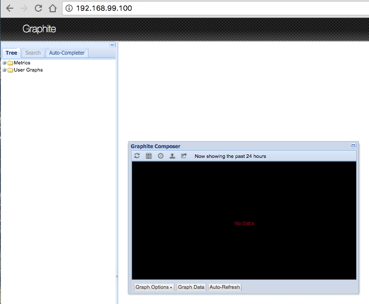
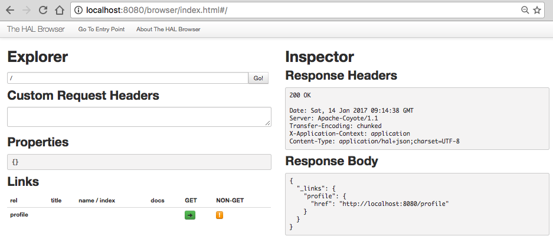

# Quest 02. [Making a Spring Boot application Production Ready](https://github.com/joshlong/cloud-native-workshop#2-making-a-spring-boot-application-production-ready) 실습

이번 퀘스트는 12개의 서브 퀘스트로 구성되어 있다.

1. Add `org.springframework.boot`:`spring-boot-starter-actuator`
1. customize the `HealthEndpoint` by contributing a custom `HealthIndicator`
1. Start `./bin/graphite.sh`
1. Configure two environment variables `GRAPHITE_HOST` (`export GRAPHITE_HOST="$DOCKER_IP"`) and `GRAPHITE_PORT` (`2003`) (you may need to restart your IDE to see these new environment variables)
1. Add a `GraphiteReporter` bean
1. Add `io.dropwizard.metrics`:`metrics-graphite`
1. Build an executable `.jar` (UNIX-specific) using the `<executable/>` configuration flag
1. Add the HAL browser - `org.springframework.data`:`spring-data-rest-hal-browser` and view the Actuator endpoints using that
1. Configure Maven resource filtering and the Git commit ID plugin in the `pom.xml` in all existing and subsequent `pom.xml`s, or extract out a common parent `pom.xml` that all modules may extend.
1. Add `info.build.artifact=${project.artifactId}` and `info.build.version=${project.version}` to `application.properties`.
1. Introduce a new `@RepositoryEventHandler` and `@Component`. Provide handlers for `@HandleAfterCreate`, `@HandleAfterSave`, and `@HandleAfterDelete`. Extract common counters to a shared method
1. Add a semantic metric using `CounterService` and observe the histogram in Graphite

**헉. 많다.**

## 2.1. `spring-boot-starter-actuator`를 추가할 것
> Add `org.springframework.boot`:`spring-boot-starter-actuator`

* `org.springframework.boot:*` 형식 문자열의 의미는 [이전 스터디](./quest00.md#14-네-번째로-할-일)에서 학습한 바 있다.  
* 프로젝트 라이브러리에 `spring-boot-starter-actuator`를 추가하라는 것.

그래서 다음과 같이 `pom.xml`에 추가해 주었다.

```xml
    <dependency>
        <groupId>org.springframework.boot</groupId>
        <artifactId>spring-boot-starter-actuator</artifactId>
    </dependency>
```

* 검색해보니 [spring-boot-actuator github](https://github.com/spring-projects/spring-boot/tree/master/spring-boot-actuator#spring-boot---actuator) 에서도 위와 같은 설치 방법을 제공한다.

### 2.1.1 그런데 `actuator`는 무엇을 하는 라이브러리일까?

[spring-boot-actuator github](https://github.com/spring-projects/spring-boot/tree/master/spring-boot-actuator#spring-boot---actuator) 에서는 다음과 같이 설명하고 있다.

> Spring Boot Actuator includes a number of additional features to help you monitor and manage your application when it’s pushed to production. You can choose to manage and monitor your application using HTTP endpoints, with JMX or even by remote shell (SSH or Telnet). Auditing, health and metrics gathering can be automatically applied to your application. The user guide covers the features in more detail.

* 요약하자면 애플리케이션을 모니터링하고 관리하는 데 도움이되는 도구 모음 정도인 듯하다.

지난 주에 구매한 [스프링 책](http://www.kyobobook.co.kr/product/detailViewKor.laf?ejkGb=KOR&mallGb=KOR&barcode=9791187345534&orderClick=LEA&Kc=)의 목차를 살펴보니 `7장. 액추에이터로 내부 들여다보기`라는 챕터 제목이 있다.

* 크레이크 월즈 지음, 황인서 옮김, [스프링부트 코딩 공작소], 길벗출판사, 초판 2016년 7월 31일
    * 190쪽

        > 액추에이터는 스프링 부트 애플리케이션에 모니터링과 메트릭 같은 출시 준비 기능을 제공한다. 액추에이터의 기능은 여러 REST 엔드포인트와 원격 셸, JMX(Java Management eXtensions)로 제공한다.

    * 191쪽

        > 스프링 부트 액추에이터의 핵심 기능은 실행 중인 애플리케이션 내부를 볼 수 있게 하는 여러 웹 엔드포인트를 애플리케이션에서 제공하는 것이다. 액추에이터를 이용하면 스프링 애플리케이션 컨텍스트의 빈들을 어떻게 연결했고, 애플리케이션에서 어떤 환경 프로퍼티를 사용할 수 있는지 확인할 수 있으며, 런타임 메트릭의 스냅샷도 확보할 수 있다.

오케이. 대충 알겠다. 넘어가자.


## 2.2. 사용자 정의 `HealthEndpoint`를 작성할 것.
> customize the `HealthEndpoint` by contributing a custom `HealthIndicator`

막막해서 일단 책을 찾아 보았더니 `7.4.5 사용자 정의 헬스 인디케이터 추가하기`라는 꼭지가 있다. 오 다행.
* 일단 예제를 참고하여 다음과 같이 새로운 클래스를 하나 작성하였다.

```java
package com.reservation.common;

import org.springframework.boot.actuate.health.Health;
import org.springframework.boot.actuate.health.HealthIndicator;
import org.springframework.stereotype.Component;
import org.springframework.web.client.RestTemplate;

// 경험상 이런 클래스 이름은 좀 길게 지어주어야 구별이 쉬웠다.
@Component
public class MySaturdayHealthIndicator implements HealthIndicator {

    public Health health() {
        try {
            RestTemplate rest = new RestTemplate();
            rest.getForObject("http://www.google.com", String.class);   // 구글에 요청 전송
            return Health.up().build();
        } catch (Exception e) {
            return Health.down().build();
        }
    }
}
```

책을 보니 `/health`엔드포인트로 결과를 볼 수 있다고 한다.
* 빌드한 다음 터미널에서 `curl localhost:8080/health | jq` 를 입력해 보니 다음과 같은 결과가 나왔다.

```json
{
  "status": "UP",
  "diskSpace": {
    "status": "UP",
    "total": 249779191808,
    "free": 155090653184,
    "threshold": 10485760
  },
  "mySaturday": {
    "status": "UP"
  },
  "db": {
    "status": "UP",
    "database": "MySQL",
    "hello": 1
  }
}
```

`mySaturday`가 큰 문제 없이 출력되었다.


## 2.3. `./bin/graphite.sh`를 실행할 것

이제부터는 Graphite라는 도구를 사용하는 모양이다.  
구글링하여 [공식 홈페이지](http://metrics.dropwizard.io/3.1.0/manual/graphite/)를 간단하게 둘러보았지만 아직은 잘 알수 없없다.

* 다음 명령어를 실행. 끝!
```
$ eval $(docker-machine env 도커머신이름)
$ ~/git/cloud-native-workshop/bin/graphite.sh
```

* docker를 사용하는 것으로 보아, docker에 서버를 띄워놓고 Spring Boot 어플리케이션과 연동하는 방식인가보다.
* 웹 브라우저를 열고 `$DOCKER_HOST`로 접속해 보니 Graphite 화면이 나타난다.


## 2.4. GRAPHITE 환경 변수 설정

> Configure two environment variables `GRAPHITE_HOST` (`export GRAPHITE_HOST="$DOCKER_IP"`) and `GRAPHITE_PORT` (`2003`) (you may need to restart your IDE to see these new environment variables)

* 다음 명령어를 실행한 다음, IDE를 재시작 하였다.
```sh
$ export GRAPHITE_HOST="$DOCKER_HOST"
$ export GRAPHITE_PORT=2003
```

## 2.5. `GraphiteReporter` Bean을 추가할 것
> Add a `GraphiteReporter` bean

Bean을 추가하려면 먼저 라이브러리를 추가해야 할 것 같다. 다음 단계에서 같이 해보자.

## 2.6. `metrics-graphite`를 추가할 것.
> Add `io.dropwizard.metrics`:`metrics-graphite`

일단 다음과 같이 `pom.xml`에 라이브러리를 추가해주었다.

```xml
    <dependency>
        <groupId>io.dropwizard.metrics</groupId>
        <artifactId>metrics-graphite</artifactId>
    </dependency>
```

그리고 Bean을 추가해주고 싶은데... 어떻게 해야 하는지 모르겠다.
* [Graphite Github](https://github.com/dropwizard/dropwizard/tree/master/dropwizard-metrics-graphite)에 가 보아도 README.md가 없다.
* 어떡하지
* [_**자바 챔피언 Josh Long**_ 아저씨의 라이브 코딩 동영상](https://www.youtube.com/watch?v=fxB0tVnAi0I)에도 없다.

웹 어딘가에 Josh Long이 작성한 GraphiteReporter Bean 코드가 있을 것 같다.  
`"graphite" "graphitereporter" "josh long"`을 구글에서 검색했더니 다음 Repository를 찾을 수 있었다.

https://github.com/joshlong/microservices-dzrc

* 예제를 그대로 복사하고, URL 입력 부분만 약간 바꾸어서 다음과 같이 작성하였다.

```java
@Bean
GraphiteReporter graphite(@Value("${graphite.prefix}") String prefix,
                          @Value("${graphite.url}") String url,
                          @Value("${graphite.port}") int port,
                          MetricRegistry registry) {
    URL address;
    try {
        address = new URL(url);
        GraphiteReporter reporter = GraphiteReporter.forRegistry(registry)
                .prefixedWith(prefix)
                .build(new Graphite(address.getHost(), port));
        reporter.start(1, TimeUnit.SECONDS);
        return reporter;
    } catch (MalformedURLException e) {
        e.printStackTrace();
        return null;
    }
}
```

`application.yml`에는 다음과 같이 추가해 주었다. `prefix`는 의미를 몰라서 일단 `test`로 넣어 두었다.
```yml
graphite:
  prefix: test
  url: http://192.168.99.100
  port: 2003
```

이렇게 하는 게 맞는 걸까.

## 2.7 실행 가능한 `.jar`파일을 빌드할 것
> Build an executable `.jar` (UNIX-specific) using the `<executable/>` configuration flag

(´･_･`)

`pom.xml`에 다음을 추가해 주었다.

```xml
    <build>
        <plugins>
            <plugin>
                <groupId>org.springframework.boot</groupId>
                <artifactId>spring-boot-maven-plugin</artifactId>
                <configuration>
                    <executable>true</executable>
                </configuration>
            </plugin>
        </plugins>
    </build>
```

터미널에서 다음과 같이 입력해보니 잘 실행된다.

```sh
$ mvn spring-boot:run
```

* 그러나 `mvn`으로 실행하는 것은 executable jar로 실행하는 방법이 아닌 것 같다.
* `pom.xml`에서 위의 `<build>`태그를 삭제해도 `mvn spring-boot:run`은 잘 돌아간다.

executable jar 로 만들었으면 `java -jar reservation.jar`로 실행할 수 있어야 할 것 같다.

그래서 IntelliJ IDEA에서 jar 설정을 해 준 다음 빌드 해보기로 했다.

* `File` > `Product Structure` > `Artifacts` > `+` > `JAR` > `From modules with dependencies...`  
순으로 선택해주면 된다.


* 그러면 `MANIFEST.MF`가 `main/java/META-INF/MANIFEST.MF`경로에 생성된다.
* `Build` > `Build Artifacts...`를 선택하면 `jar` 파일로 빌드할 수 있다.

하지만 실행해 보면 `MANIFEST.MF`가 없다면서 실행되지 않는다.

* `MANIFEST.MF`파일을 조심스럽게 `resource/META-INF`경로로 옮기고 빌드해보니 `MANIFEST.MF` 문제는 해결됐다.
* IntelliJ IDEA에 문제가 있는 걸까? 아니다. 보통 이런 경우는 내가 툴을 잘못 이해한 것.

`java -jar demo.jar`를 실행하면 터미널에 스프링 로고도 잘 나오고 좍좍 잘 내려간다.

하지만 어느 정도 출력된 이후 에러가 잔뜩 발생하는데, 아마도 `application.yml`을 찾지 못해 발생하는 에러 같았다.
* 이건 해결하지 못했다.

이 단계와 바로 전 단계가 좀 힘겨웠다. 다음 단계로 넘어가자.

## 2.8. `HAL browser`를 추가할 것
> Add the HAL browser - `org.springframework.data`:`spring-data-rest-hal-browser` and view the Actuator endpoints using that

`pom.xml`파일에 다음을 추가해 주었다.

```xml
    <dependency>
        <groupId>org.springframework.data</groupId>
        <artifactId>spring-data-rest-hal-browser</artifactId>
    </dependency>
```

Run 하고 웹 브라우저를 통해 `http://localhost:8080/`로 들어가보니 다음과 같이 나온다.



## 2.9. `Maven resource filtering`과 `Git commit ID plugin`을 설정할 것.
> Configure Maven resource filtering and the Git commit ID plugin in the `pom.xml` in all existing and subsequent `pom.xml`s, or extract out a common parent `pom.xml` that all modules may extend.

언뜻 이해가 안 가니 문장을 분해해보자.

* `pom.xml`에 `Maven resource filtering`을 설정하라.
* `pom.xml`에 `Git commit ID plugin`을 설정하라.
* 설정할 때에는 모든 `pom.xml`에 설정해주거나, 공통 부모 `pom.xml`에 설정해주면 된다.

나는 `pom.xml`파일이 하나니까, `Maven resource filtering`과 `Git commit ID plugin`만 설정해주면 될 것 같다.

### 2.9.1. `Maven resource filtering`

* [Apache Maven Filtering](https://maven.apache.org/plugins/maven-resources-plugin/examples/filter.html)문서를 참고하였다.
* `pom.xml`의 `<build>` 태그 내에 다음과 같이 추가하였다.

```xml
    <resources>
        <resource>
            <directory>src/main/resources</directory>
            <filtering>true</filtering>
            <includes>
                <include>**/*.properties</include>
                <include>**/*.xml</include>
                <include>**/*.yml</include>
                <include>**/*.MF</include>
            </includes>
        </resource>
    </resources>
```

### 2.9.2. `Maven Git commit ID plugin`

* [Github의 설치 문서](https://github.com/ktoso/maven-git-commit-id-plugin/blob/master/README.md#getting-snapshot-versions-of-the-plugin)을 참고하였다.
* 쭉 훑어보니 꽤 쓸모있어 보이는 플러그인이다. 빌드 당시 git branch, commit 등의 정보를 properties에 입력해주는듯.
* 설치 문서를 참고하여 다음과 같이 `pom.xml`에 추가하였다.

```xml
    <pluginRepository>
        <id>sonatype-snapshots</id>
        <name>Sonatype Snapshots</name>
        <url>https://oss.sonatype.org/content/repositories/snapshots/</url>
    </pluginRepository>
```

그리고 `pom.xml`의 `<build>`태그 내에 다음과 같이 추가해 주었다.
```xml
    <plugin>
        <groupId>pl.project13.maven</groupId>
        <artifactId>git-commit-id-plugin</artifactId>
        <version>2.2.1</version>
        <executions>
            <execution>
                <id>get-the-git-infos</id>
                <goals>
                    <goal>revision</goal>
                </goals>
            </execution>
            <execution>
                <id>validate-the-git-infos</id>
                <!-- 아래의 validateRevision은 에러가 발생해서 주석처리 해두었다 -->
                <goals> <!--<goal>validateRevision</goal>--> </goals>
                <phase>package</phase>
            </execution>
        </executions>
        <configuration>
            <generateGitPropertiesFile>true</generateGitPropertiesFile>
            <generateGitPropertiesFilename>${project.build.outputDirectory}/git.properties</generateGitPropertiesFilename>
        </configuration>
    </plugin>
```

자아 이제 설정을 마쳤으니 값을 가져와 화면으로 확인해보자.

* 실제로 사용을 해보기 위해 설치 문서를 쭉 읽어 보았는데... 아아 굉장히 길고 복잡했다.
* 이렇게 저렇게 아무리 따라해 보아도 제대로 돌아가질 않는다.
* 돌아가질 않으니 기분도 울적하고, 산책을 다녀와도 춥기만 하고 문제가 해결되지 않았다.

그러다 좀 더 아래쪽을 보니 지금까지 나열한 방법보다 [쉬운 방법](https://github.com/ktoso/maven-git-commit-id-plugin/blob/master/README.md#the-easier-way-generate-gitproperties)이 있다면서 아주 짧고 간결한 방법을 소개하고 있었다.

* 몹시 기분이 좋지 않았다.
* 앞으로는 무조건 끝까지 읽어보고 해야지.
* 그래도 이런 식으로 `README`를 쓰면 사용자들에게 욕을 먹을테니 **나는 이러지 말아야지** 하는 교훈을 얻었다.

**쉬운 방법**에서 소개하고 있는 방식을 따라해 보자.  

```xml
<configuration>
    <generateGitPropertiesFile>true</generateGitPropertiesFile>
    <generateGitPropertiesFilename>${project.build.outputDirectory}/git.properties</generateGitPropertiesFilename>
</configuration>
```

**쉬운 방법**에 따르면 위와 같이 `<configuration>`을 설정하면 `git.properties`파일을 자동으로 생성해준다고 한다.  
내가 두 시간을 날려버린 바로 그 부분이다!

어디 정말 생성되나 보자는 마음으로 다음과 같이 `mvn clean install`을 실행해 주었다.  
이렇게 할 때마다 `git.properties`가 갱신되는 모양이다.
```sh
$ mvn clean install -Dmaven.test.skip=true && mvn clean package -Pdemo -Dmaven.test.skip=true
```

이제 정말 생성되었는지 확인해 보자.
* 빌드를 필요로 하는 과정이었으니까 `/target/classes` 하위 경로에 생성되었을 것이다.
* 찾아보니 `/target/classes/git.properties`로 파일이 생성되어 있다.
* 내용을 보니 다음과 같다.

```properties
#Generated by Git-Commit-Id-Plugin
#Sat Jan 14 22:44:24 KST 2017
git.build.user.email=johngrib@woowahan.com
git.build.host=Johnui-MacBook-Pro.local
git.dirty=true
git.remote.origin.url=git@github.com\:johngrib/cloudnative_study.git
git.closest.tag.name=
git.commit.id.describe-short=a94f151-dirty
git.commit.user.email=johngrib@woowahan.com
git.commit.time=2017-01-08T15\:14\:17+0900
git.commit.message.full=jooq 컨트롤러에 맞춰 테스트 코드 수정
git.build.version=0.0.1-SNAPSHOT
git.commit.message.short=jooq 컨트롤러에 맞춰 테스트 코드 수정
git.commit.id.abbrev=a94f151
git.branch=quest02
git.build.user.name=John Grib

# ...이하 생략...
```

주석을 보고 22시 44분이 되었다는 걸 알았다. 일단 자러 가고 내일 이어서 해야겠다.

------

`git.properties`파일이 자동 생성된 것은 확인했으니 이제 가져다 쓰는 예제도 따라해 보고 싶었다.

하지만 예제대로 하면 제대로 되지 않는다. 내가 이해를 제대로 못해서일까? 예제 때문에 시간만 잔뜩 낭비한 느낌.

그래서 그냥 property 값을 가져오도록 해 보았다.

```java
package com.reservation.common;

import lombok.Data;
import org.springframework.boot.context.properties.ConfigurationProperties;
import org.springframework.context.annotation.Configuration;
import org.springframework.context.annotation.PropertySource;
import java.util.Map;

@Data
@Configuration
@ConfigurationProperties
@PropertySource("classpath:git.properties")
public class GitRepositoryState {

  Map<String, String> git;

  @Override
  public String toString() {
    return "GitRepositoryState{" + "git=" + git + '}';
  }
}
```

그리고 `GitController`로 만들어 주었다.

```java
package com.reservation.controller;

import com.reservation.common.GitRepositoryState;
import org.springframework.beans.factory.annotation.Autowired;
import org.springframework.web.bind.annotation.RequestMapping;
import org.springframework.web.bind.annotation.RestController;

@RestController
@RequestMapping("/git")
public class GitController {

  @Autowired
  GitRepositoryState gitRepoState;

  public GitController() { }

  @RequestMapping("/status")
  public Object checkGitRevision() {
    return gitRepoState.toString();
  }
}
```

Run 한 다음, `curl http://localhost:8080/git/status`로 확인해 보았더니 다음과 같은 결과가 나왔다.
```sh
GitRepositoryState{git={build.user.email=johngrib@woowahan.com, build.host=Johnui-MacBook-Pro.local, dirty=true, remote.origin.url=git@github.com:johngrib/cloudnative_study.git, closest.tag.name=, commit.user.email=johngrib@woowahan.com, commit.time=2017-01-08T15:14:17+0900, ...중략... , commit.user.name=John Grib}}
```

## 2.10. `application.properties`에 `artifact`와 `version` 추가
> Add `info.build.artifact=${project.artifactId}` and `info.build.version=${project.version}` to `application.properties`.

이건 어려울 것 없다. 다음과 같이 `application.properties`에 추가해 주었다.
```properties
info.build.artifact=${project.artifactId}
info.build.version=${project.version}
```

## 2.11. `@RepositoryEventHandler` 등을 도입한다
> Introduce a new `@RepositoryEventHandler` and `@Component`. Provide handlers for `@HandleAfterCreate`, `@HandleAfterSave`, and `@HandleAfterDelete`. Extract common counters to a shared method

`Introduce`는 두 가지 의미가 있다.

1. 소개하라.
1. 도입하라.

전자라면, 내가 지금 참고하고 있는 [Josh Long의 README](https://github.com/johngrib/cloud-native-workshop)는 가르치는 사람이 보기 위한 강의 노트가 된다.  

나는 두 번째 의미로 받아들이기로 했다.

일단 다음과 같이 새로운 클래스를 추가하였다.

```java
package com.reservation.handler;

import com.reservation.domain.Reservation;
import org.springframework.data.rest.core.annotation.HandleAfterCreate;
import org.springframework.data.rest.core.annotation.HandleAfterDelete;
import org.springframework.data.rest.core.annotation.HandleAfterSave;
import org.springframework.data.rest.core.annotation.RepositoryEventHandler;

@RepositoryEventHandler(Reservation.class)
public class ReservationRepositoryHandler {

    @HandleAfterCreate
    public void afterCreate(Reservation res) {
    }

    @HandleAfterSave
    public void afterSave(Reservation res) {
    }

    @HandleAfterDelete
    public void afterDelete(Reservation res) {
    }
}
```

작동하게 해보고 싶은데, 지금은 너무 늦었고 피곤하다.

## 2.12.
> Add a semantic metric using `CounterService` and observe the histogram in Graphite

`CounterService`라는 것을 사용해서 Graphite로 모니터링하는 것이 목표인듯하다.  
사이트 접속자 수라던가 DB입출력 횟수 등을 카운트하는 것일까?  
오늘 스터디는 꽤 스트레스 받는 편이었다. 이건 다음에 하자.
